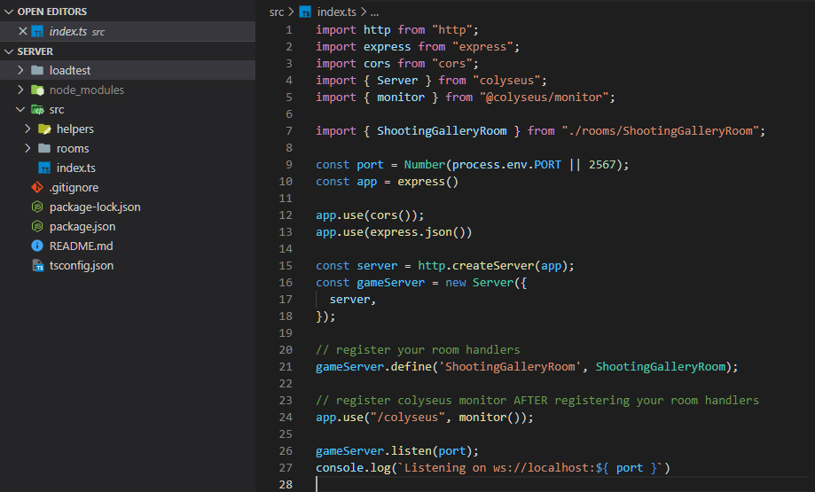

# Modifying an Existing Colyseus Server

If you already have a Colyseus server or initially started with a self-hosting setup you might have a server folder structure and index file that looks like this.

### Self-hosted index.ts



## Changes required for Arena Cloud

To use Arena Cloud you will have to modified the above server code to work with the current **NPM** Colyseus template. Overall these modifications are minor for exiting 0.14 servers. The changes only require that you move your room definitions and custom express routes into the ```arena.config``` file. For the above example the following would be the correct way to modify the server code.

!!! NOTE   
    You will notice we don't require definitions for transports or drivers on Arena Cloud. This is because Arena Clouds runs all required services and databases needed to host a Colyseus Server at scale for you in the background. Because of this you as a developer will not need define ***presence*** / ***matchmaking*** drivers or deploy & host their required databases.


### Modified arena.config.ts

```
import Arena from "@colyseus/arena";
import { monitor } from "@colyseus/monitor";
import { ShootingGalleryRoom } from "./rooms/ShootingGalleryRoom";

const port = Number(process.env.PORT);

export default Arena({
    getId: () => "Your Colyseus App",

    initializeGameServer: (gameServer) => {

        gameServer.define('ShootingGalleryRoom', ShootingGalleryRoom);

    },

    initializeExpress: (app) => {

        app.get("/", (req, res) => {
            res.send("It's time to kick ass and chew bubblegum!");
        });

        app.use("/colyseus", monitor());
    },


    beforeListen: () => {
        console.log(`Listening on ws://localhost:${ port }`)
    }
});
```

### Modified Folder Structure

